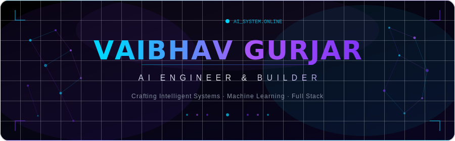
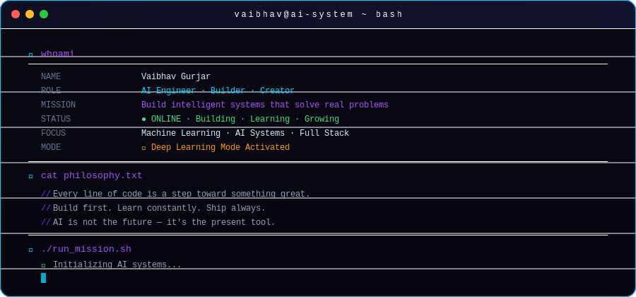
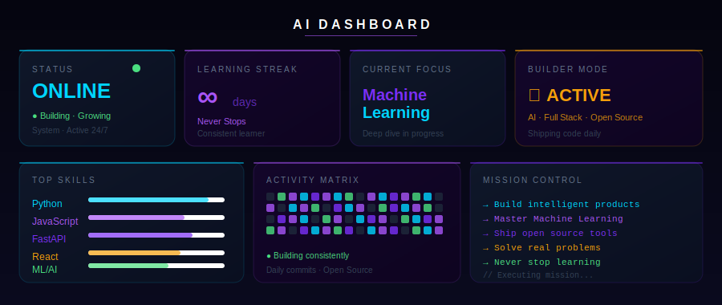
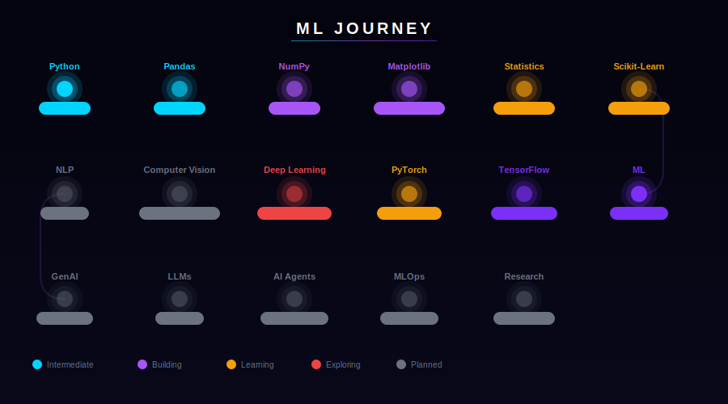
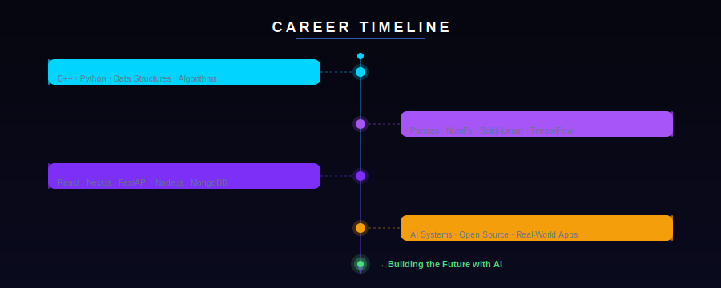
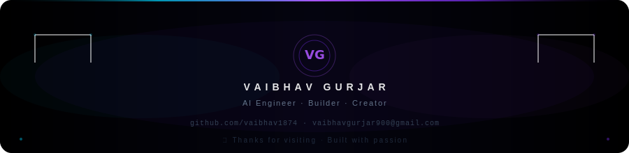

<!-- ████████████████████████████████████████████████████████████████████████ -->
<!-- ██  VAIBHAV GURJAR · AI ENGINEER · GITHUB PROFILE README              ██ -->
<!-- ██  Designed as a futuristic AI OS. Every pixel is intentional.       ██ -->
<!-- ████████████████████████████████████████████████████████████████████████ -->

<div align="center">

<!--═══════════════════════════════════════════════════════════════════════════
    §1 · ANIMATED HERO BANNER
══════════════════════════════════════════════════════════════════════════════-->



<br/>

<!-- Typing animation via readme-typing-svg -->
<a href="https://github.com/vaibhav1874">
  
</a>

<br/><br/>

<!-- Premium shield badges -->
<a href="mailto:vaibhavgurjar900@gmail.com">
  
</a>&nbsp;
<a href="https://www.linkedin.com/in/vaibhavgurjar">
  
</a>&nbsp;
<a href="https://github.com/vaibhav1874">
  
</a>

<br/><br/>

<!-- Visitor counter -->


</div>


<!--═══════════════════════════════════════════════════════════════════════════
    §2 · AI TERMINAL — whoami
══════════════════════════════════════════════════════════════════════════════-->

<div align="center">

<h2>
  
</h2>



</div>


<!--═══════════════════════════════════════════════════════════════════════════
    §3 · AI DASHBOARD
══════════════════════════════════════════════════════════════════════════════-->

<div align="center">

<h2>
  
</h2>



</div>


<!--═══════════════════════════════════════════════════════════════════════════
    §4 · TECH ARSENAL
══════════════════════════════════════════════════════════════════════════════-->

<div align="center">

<h2>
  
</h2>

<!-- Languages -->
<details open>
<summary><b>&nbsp;⟨ &nbsp;Languages &nbsp;⟩</b></summary>
<br/>


</details>

<br/>

<!-- AI & ML -->
<details open>
<summary><b>&nbsp;⟨ &nbsp;AI · Machine Learning · Deep Learning &nbsp;⟩</b></summary>
<br/>

<table align="center">
<tr>
<td align="center" width="100">
<br/>
<sub><b>Pandas</b></sub>
</td>
<td align="center" width="100">
<br/>
<sub><b>NumPy</b></sub>
</td>
<td align="center" width="120">
<br/>
<sub><b>Matplotlib</b></sub>
</td>
<td align="center" width="120">
<br/>
<sub><b>Scikit-Learn</b></sub>
</td>
<td align="center" width="120">
<br/>
<sub><b>TensorFlow</b></sub>
</td>
<td align="center" width="100">
<br/>
<sub><b>PyTorch</b></sub>
</td>
<td align="center" width="100">
<br/>
<sub><b>OpenCV</b></sub>
</td>
</tr>
<tr>
<td align="center">
<br/>
<sub><b>LangChain</b></sub>
</td>
<td align="center">
<br/>
<sub><b>Hugging Face</b></sub>
</td>
<td align="center">
<br/>
<sub><b>OpenAI API</b></sub>
</td>
<td align="center" colspan="4">
<br/>
<sub><b>RAG Pipelines</b></sub>
</td>
</tr>
</table>

</details>

<br/>

<!-- Frontend -->
<details open>
<summary><b>&nbsp;⟨ &nbsp;Frontend &nbsp;⟩</b></summary>
<br/>


</details>

<br/>

<!-- Backend -->
<details open>
<summary><b>&nbsp;⟨ &nbsp;Backend · Database · Cloud &nbsp;⟩</b></summary>
<br/>


</details>

<br/>

<!-- Tools -->
<details open>
<summary><b>&nbsp;⟨ &nbsp;Tools · Design &nbsp;⟩</b></summary>
<br/>


</details>

</div>


<!--═══════════════════════════════════════════════════════════════════════════
    §5 · MACHINE LEARNING JOURNEY — ANIMATED ROADMAP
══════════════════════════════════════════════════════════════════════════════-->

<div align="center">

<h2>
  
</h2>



<br/>

<!-- Status legend as shields -->

&nbsp;

&nbsp;

&nbsp;

&nbsp;


</div>


<!--═══════════════════════════════════════════════════════════════════════════
    §6 · CURRENT FOCUS
══════════════════════════════════════════════════════════════════════════════-->

<div align="center">

<h2>
  
</h2>

<table>
<tr>
<td align="center" width="200">

<br/>

<br/><sub>Deep diving into ML algorithms, model training, and evaluation pipelines.</sub><br/><br/>

</td>
<td align="center" width="200">

<br/>

<br/><sub>Building end-to-end intelligent systems that work in the real world.</sub><br/><br/>

</td>
<td align="center" width="200">

<br/>

<br/><sub>Crafting robust APIs and scalable backend architectures with FastAPI & Node.js.</sub><br/><br/>

</td>
</tr>
<tr>
<td align="center" width="200">

<br/>

<br/><sub>Creating premium UI/UX with React, Next.js, and modern CSS.</sub><br/><br/>

</td>
<td align="center" width="200">

<br/>

<br/><sub>Contributing to open source projects and sharing reusable tools.</sub><br/><br/>

</td>
<td align="center" width="200">

<br/>

<br/><sub>Turning hard problems into elegant, minimal, working solutions.</sub><br/><br/>

</td>
</tr>
</table>

</div>


<!--═══════════════════════════════════════════════════════════════════════════
    §7 · GITHUB ANALYTICS
══════════════════════════════════════════════════════════════════════════════-->

<div align="center">

<h2>
  
</h2>

<br/>

<!-- Stats + Languages side by side -->

&nbsp;


<br/><br/>

<!-- Streak -->


<br/><br/>

<!-- Contribution graph -->


<br/><br/>

<!-- Trophies -->


<br/><br/>

<!-- Snake animation -->
<picture>
  <source media="(prefers-color-scheme: dark)" srcset="https://raw.githubusercontent.com/vaibhav1874/vaibhav1874/output/github-snake-dark.svg"/>
  <source media="(prefers-color-scheme: light)" srcset="https://raw.githubusercontent.com/vaibhav1874/vaibhav1874/output/github-snake.svg"/>
  
</picture>

</div>


<!--═══════════════════════════════════════════════════════════════════════════
    §8 · CAREER TIMELINE
══════════════════════════════════════════════════════════════════════════════-->

<div align="center">

<h2>
  
</h2>



</div>


<!--═══════════════════════════════════════════════════════════════════════════
    §9 · CODE PHILOSOPHY
══════════════════════════════════════════════════════════════════════════════-->

<div align="center">

<h2>
  
</h2>

</div>

```python
#!/usr/bin/env python3
# ──────────────────────────────────────────────────────────────
#  philosophy.py  ·  Vaibhav Gurjar  ·  AI Engineer
# ──────────────────────────────────────────────────────────────

class Engineer:
    name    = "Vaibhav Gurjar"
    mindset = "Never Stop Learning"
    mission = "Build intelligent systems that matter"
    focus   = ["AI", "Machine Learning", "Full Stack", "Open Source"]
    mode    = "Builder Mode: ON ⚡"

    def approach(self) -> str:
        return "Build first · Learn constantly · Ship always"

    def status(self) -> str:
        return "● ONLINE — Writing code, solving problems, growing daily"


if __name__ == "__main__":
    vaibhav = Engineer()

    while True:
        vaibhav.learn()      #  absorb knowledge every day
        vaibhav.build()      #  turn ideas into working products
        vaibhav.improve()    #  iterate, refactor, optimize
        vaibhav.ship()       #  deliver value to the world
        # repeat → ∞
```

<div align="center">

<br/>

> *"The best way to learn something is to build something with it."*

</div>


<!--═══════════════════════════════════════════════════════════════════════════
    §10 · RANDOM DAILY QUOTE  (auto-updated by GitHub Actions)
══════════════════════════════════════════════════════════════════════════════-->

<div align="center">

<h2>
  
</h2>

<!-- Auto-updated quote injected here by quotes.yml GitHub Action -->
<!-- BEGIN_QUOTE -->
> "Build things that matter. Ship things that work. Learn things that last."
>
> — **Unknown**
<!-- END_QUOTE -->

<br/>


</div>


<!--═══════════════════════════════════════════════════════════════════════════
    §11 · CONNECT — GLASS BUTTONS
══════════════════════════════════════════════════════════════════════════════-->

<div align="center">

<h2>
  
</h2>

<br/>

<a href="https://github.com/vaibhav1874">
  
</a>
&nbsp;&nbsp;
<a href="https://www.linkedin.com/in/vaibhavgurjar">
  
</a>
&nbsp;&nbsp;
<a href="mailto:vaibhavgurjar900@gmail.com">
  
</a>

<br/><br/>

<!-- Open to opportunities badge -->


</div>


<!--═══════════════════════════════════════════════════════════════════════════
    §12 · PREMIUM FOOTER
══════════════════════════════════════════════════════════════════════════════-->

<div align="center">



<br/>

<sub>
  <kbd>Crafted with passion · Powered by AI · Deployed on GitHub</kbd>
  &nbsp;·&nbsp;
  <kbd>© 2026 Vaibhav Gurjar</kbd>
</sub>

</div>

<!-- ████████████████████████████████████████████████████████████████████████ -->
<!-- END OF README · vaibhav1874/vaibhav1874                                  -->
<!-- ████████████████████████████████████████████████████████████████████████ -->
